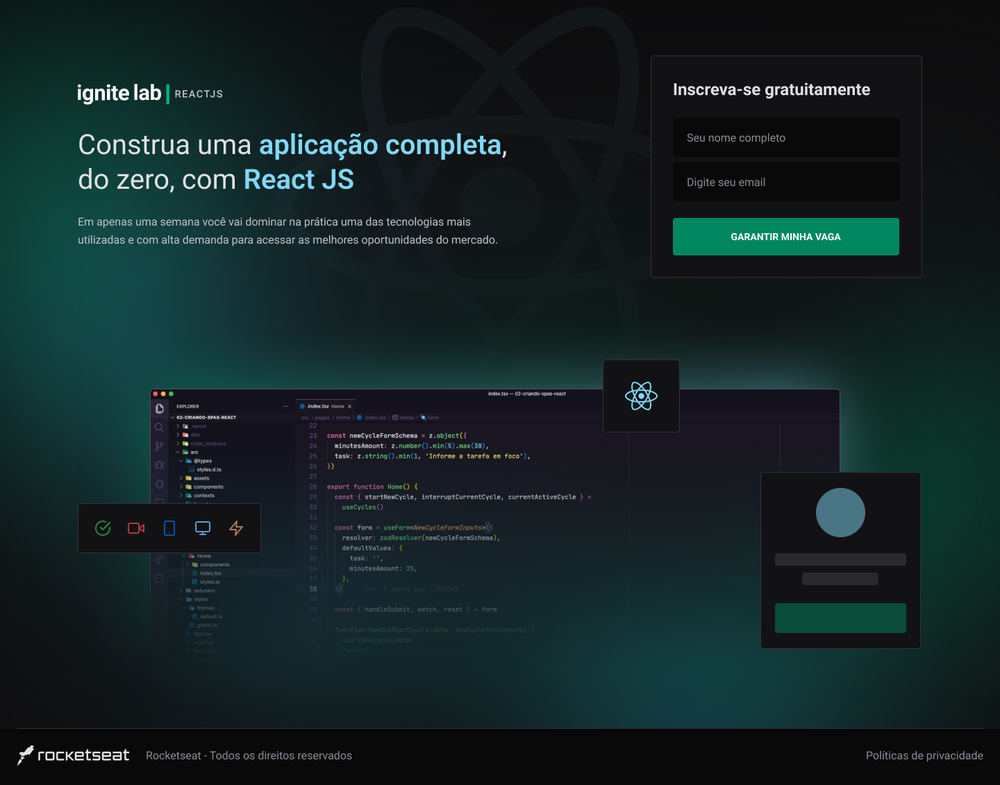

<p align="center">
  <a href="#-layout">Layout</a> •
  <a href="#-technologies">Technologies</a> •
  <a href="#-getting-started">Getting started</a> •
</p>

## :framed_picture: Imagens ##

<h1 align="center">
    
    
    <div>
      
      
    </div>
</h1>

## 🔖 About this project

The project aims to study and develop an application in React

## 🚀 Technologies

- [React](https://reactjs.org/)
- [Tailwind CSS](https://tailwindcss.com/)
- [TypeScript](https://www.typescriptlang.org/)
- [Apollo GraphQL Client](https://www.apollographql.com/docs/react/)
- [Vitejs](https://vitejs.dev/)
- [Phosphor icons](https://phosphoricons.com/)
- [Date-fns](https://date-fns.org/)
- [VimeJs](https://vimejs.com/getting-started/installation)
- [GraphCMS](https://graphcms.com/)

## 💻 Getting started

### Requirements

- [Node.js](https://nodejs.org/en/)
- [Yarn](https://classic.yarnpkg.com/) or [npm](https://www.npmjs.com/package/npm)
- [GraphCMS](https://graphcms.com/)

**Clone the project and access the folder**

```bash
git clone git@github.com:tiagopires123/event-plataform.git && cd event-plataform
```

**Follow the steps below**

### Server

```bash
# From the project root folder access the 'server' folder
$ cd event-plataform

# Install the dependencies
$ npm install

# Make a copy of '.env.example' to '.env.local'
# and set with YOUR environment variables from GraphCMS (https://graphcms.com/).
$ cp .env.example .env.local

# Start the server
$ npm run dev
```

---

<p align="center">
  Made with 💜
</p>


<!-- 
Step by

1. npm i tailwindcss postcss autoprefixer -D
2. npx tailwindcss init -p
3. dentro de tailwind.config.js -> './src/**/*.tsx' arquivos que terão estilização do tailwind
4. definir styles/global.css @tailwind base; @tailwind components @tailwind utilities;
5. instalar extensões graphQL, Tailwind CSS, PostCSS
6. Clonar graphcms com os atributos ja criados https://rseat.in/lab-graphcms
7. npm i @apollo/client graphql
8. add extend custom colors tailwind.config.js
9. add fontFamily extend Roboto em tailwind.config.js e index.html
10. npm i phosphor-react
11. npm i date-fns
12. npm i @vime/core @vime/react --force ('force' biblioteca não compatível com a feature de stream SSR do react 18)
13. npm i react-router-dom

// CMS = Content Management System
// Traz tanto o painel de ADMIN tanto quanto a parte visual do front-end (temas)
// Headless CMS (GraphCMS): Painle de ADMIN (Dados fornecidos através de uma API REST ou GraphQL)
// React que consome essa api do CMS

-->